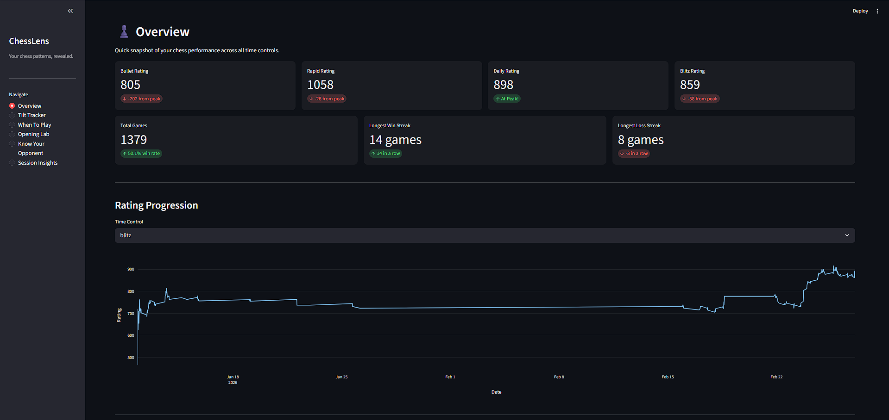
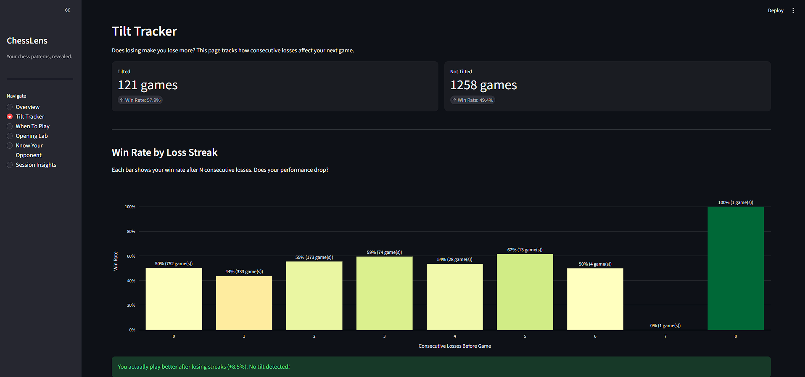
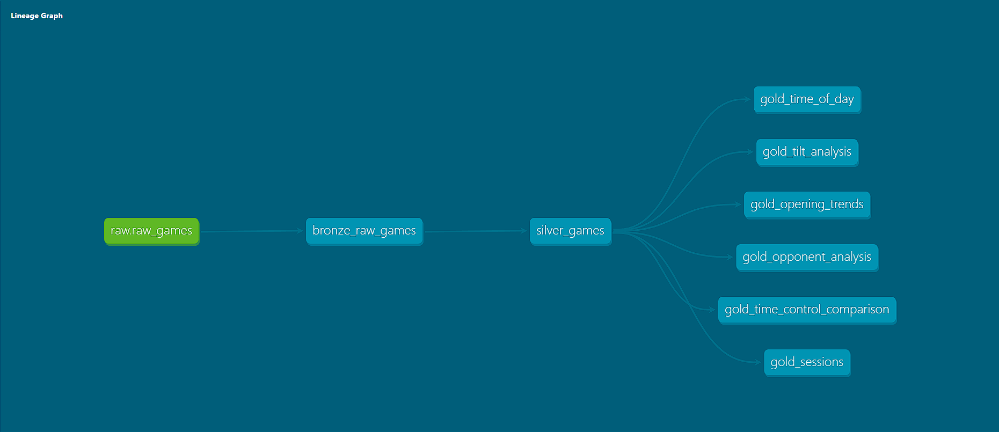
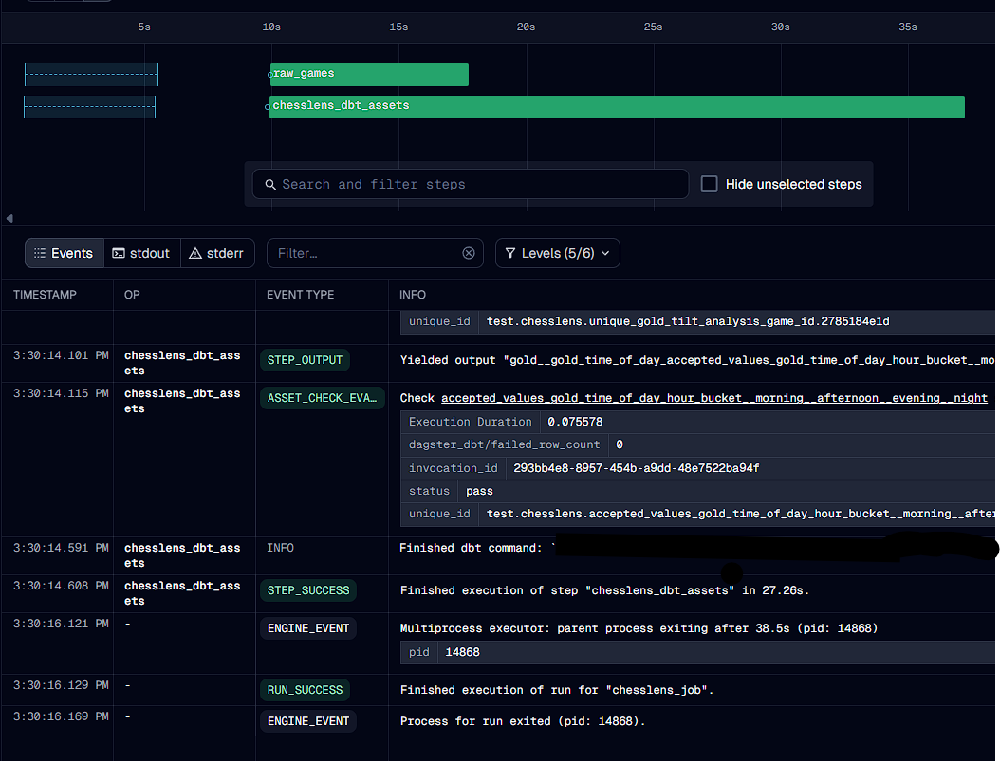
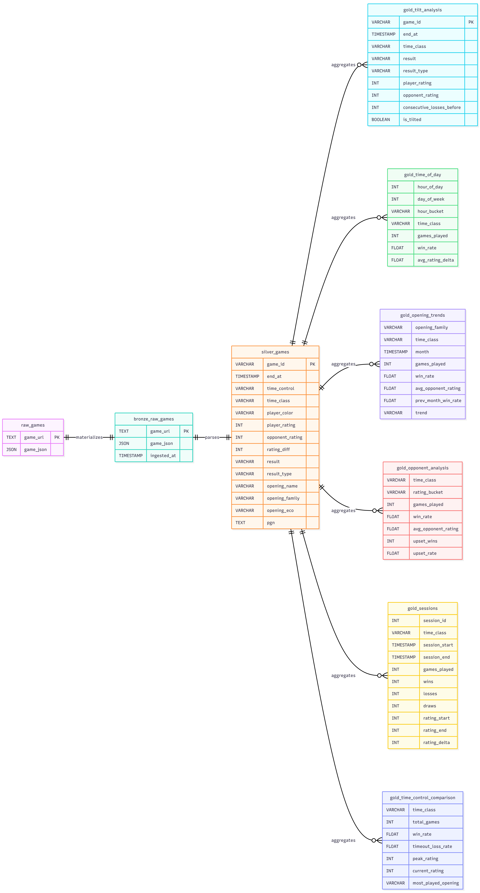

# ChessLens

A chess analytics platform that pulls games from chess.com and reveals patterns the platform doesn't show you. Any chess.com player can enter their username and get a full analysis.





## What It Does

Chess.com tells you your win rate and shows a rating graph. ChessLens answers the questions that actually matter:

- **Am I tilting?** Tracks how consecutive losses affect your next game
- **When should I play?** Heatmap of win rate by hour and day of week
- **When should I stop?** How session length impacts your rating
- **Which openings are working?** Monthly trends with improving/declining detection
- **Who do I struggle against?** Performance by opponent rating range
- **What's my best format?** Side-by-side comparison across bullet, blitz, rapid
- **Game Replay** Step through any game move by move with time spent per move
- **Stockfish Analysis** On-demand engine evaluation with accuracy score, blunder/mistake/inaccuracy detection, and eval bar

## Multi-User Support

Enter any chess.com username. If it's a new user, ChessLens pulls all their games, runs the transformation pipeline, and builds their dashboard automatically. Returning users can refresh their data from the sidebar.

## Sample Findings (from 1,379 games)

- **No tilt detected.** Win rate after 3+ consecutive losses: 59.5%. Normal win rate: 50.4%. Losing streaks apparently make me focus harder.
- **Night chess is bad.** Monday night blitz: 14.3% win rate. Tuesday night blitz: 20%. Close the laptop after midnight.
- **Scotch Game is improving.** Rapid win rate went from 44% in January to 61% in March.
- **18% of bullet games lost on time.** Nearly one in five.
- **6-10 game sessions are the sweet spot.** Shorter sessions average -0.9 rating. 6-10 game sessions average +7.1.
- **14-game win streak.** Had no idea until I ran the query.
- **51.5% as white, 48.8% as black.** Small gap, consistent with first-move advantage.

## How It Works

Games come in from the chess.com public API through a Python ingestion script that handles both full backfill and incremental loading. Raw JSON lands in DuckDB, then dbt transforms it through three layers: bronze (raw), silver (cleaned and typed), gold (analytics). Dagster orchestrates the pipeline with a daily schedule. Streamlit serves the dashboard. Stockfish evaluates individual games on demand from the replay page.

```
chess.com API --> Python --> DuckDB (bronze) --> dbt (silver) --> dbt (gold) --> Streamlit
                                                                                    |
                                                                              Stockfish (on-demand)
                                                     |
                                               Dagster orchestrates
```





## Stack

| Layer          | Tool              | Why                                                |
|----------------|-------------------|----------------------------------------------------|
| Ingestion      | Python + requests | Direct API calls with rate limiting and backfill   |
| Storage        | DuckDB            | Fits in memory, no server to manage                |
| Transformation | dbt-core          | Medallion architecture with 18 tests               |
| Orchestration  | Dagster           | Asset-based DAG with built-in dbt integration      |
| Dashboard      | Streamlit + Plotly | 7 pages with filters, charts, and game replay     |
| Engine         | Stockfish         | Position evaluation, accuracy scoring, move classification |

## Data Model



### Bronze
Raw JSON from the chess.com API. No transformations. Source of truth.

### Silver
Parsed game records with player perspective applied. Determines which side the player was on, extracts ratings, results, openings, and PGN. Incremental materialization. Multi-user via username column.

### Gold

| Model                        | Question                                                 |
|------------------------------|----------------------------------------------------------|
| `gold_tilt_analysis`         | Does losing make me lose more?                           |
| `gold_time_of_day`           | When am I sharpest?                                      |
| `gold_sessions`              | How many games should I play in one sitting?             |
| `gold_opening_trends`        | Which openings are improving or declining?               |
| `gold_opponent_analysis`     | How do I perform against stronger vs weaker opponents?   |
| `gold_time_control_comparison`| Am I better at blitz or rapid?                          |

### Evaluation Cache
Stockfish results stored in `game_evaluations` table. Populated on demand from the replay page. Not managed by dbt since it's written by the dashboard directly.

## Setup

### Prerequisites
- Python 3.10+
- Stockfish binary (download from [stockfishchess.org](https://stockfishchess.org/download))

### Installation

```bash
git clone https://github.com/MostafaNabilll/chesslens.git
cd chesslens

python -m venv venv
source venv/bin/activate  # Windows: .\venv\Scripts\Activate

pip install -r requirements.txt
```

### Stockfish Setup

Download Stockfish and place the binary in the `bin/` directory:

```
chesslens/
├── bin/
│   └── stockfish.exe    # or stockfish on Linux/Mac
```

### Configuration

Create a `.env` file in the project root:

```
CHESS_USERNAME=your_chess_com_username
CHESSLENS_DB_PATH=full/path/to/chesslens/data/chesslens.duckdb
```

### Run the Dashboard

```bash
cd dashboard
streamlit run app.py
```

Enter any chess.com username. The pipeline runs automatically for new users.

### Run the Pipeline Manually

```bash
# Backfill all historical games
python ingestion/extract.py --backfill --username your_username

# Run dbt transformations
cd dbt_chesslens
dbt build --full-refresh

# Or use Dagster to orchestrate
dagster dev -m orchestration.definitions
```

## Project Structure

```
chesslens/
├── ingestion/
│   └── extract.py                  # Chess.com API ingestion (backfill + incremental)
├── dbt_chesslens/
│   ├── models/
│   │   ├── bronze/
│   │   │   └── bronze_raw_games.sql
│   │   ├── silver/
│   │   │   └── silver_games.sql
│   │   └── gold/
│   │       ├── gold_tilt_analysis.sql
│   │       ├── gold_time_of_day.sql
│   │       ├── gold_opening_trends.sql
│   │       ├── gold_opponent_analysis.sql
│   │       ├── gold_sessions.sql
│   │       └── gold_time_control_comparison.sql
│   ├── models/schema.yml           # Column docs and 18 tests
│   ├── dbt_project.yml
│   └── profiles.yml
├── orchestration/
│   ├── assets.py                   # Dagster assets (ingestion + dbt)
│   └── definitions.py              # Job, schedule, and resource config
├── dashboard/
│   ├── app.py                      # Username input, page routing, pipeline trigger
│   ├── utils.py                    # DB connection, Stockfish evaluation, shared helpers
│   └── pages/
│       ├── 1_Overview.py           # Rating cards, streaks, rating progression, win rate by color
│       ├── 2_Tilt_Tracker.py       # Consecutive loss impact analysis
│       ├── 3_When_To_Play.py       # Time-of-day heatmap
│       ├── 4_Opening_Lab.py        # Monthly opening trends
│       ├── 5_Know_Your_Opponent.py # Performance by opponent strength
│       ├── 6_Session_Insights.py   # Session length analysis
│       └── 7_Game_Replay.py        # Move-by-move replay with Stockfish analysis
├── bin/                            # Stockfish binary (gitignored)
├── data/                           # DuckDB database (gitignored)
├── docs/                           # Screenshots and lineage graphs
├── .env.example
├── requirements.txt
└── README.md
```

## Key Design Decisions

**DuckDB over Spark** - 1,300 games fit in memory. Spark would be overengineering.

**Dagster over Airflow** - Asset model maps to medallion layers. Built-in dbt integration. No Docker needed for local dev.

**Incremental silver, full-refresh gold** - Silver appends new games without rebuilding. Gold models aggregate across all data so they rebuild each run.

**On-demand Stockfish over batch** - Evaluating all games upfront would take hours. Instead, users trigger analysis per game from the replay page. Results are cached so each game is only evaluated once.

**Single DuckDB with username column** - Multi-user data stored in one database with username partitioning in every model. Matches how production data platforms work.

## Roadmap

- **Accuracy calibration** - fine-tuning the accuracy formula to better match chess.com's CAPS2 scoring

- **Fine-tuned chess coaching model** - Train on top player data to generate personalized recommendations